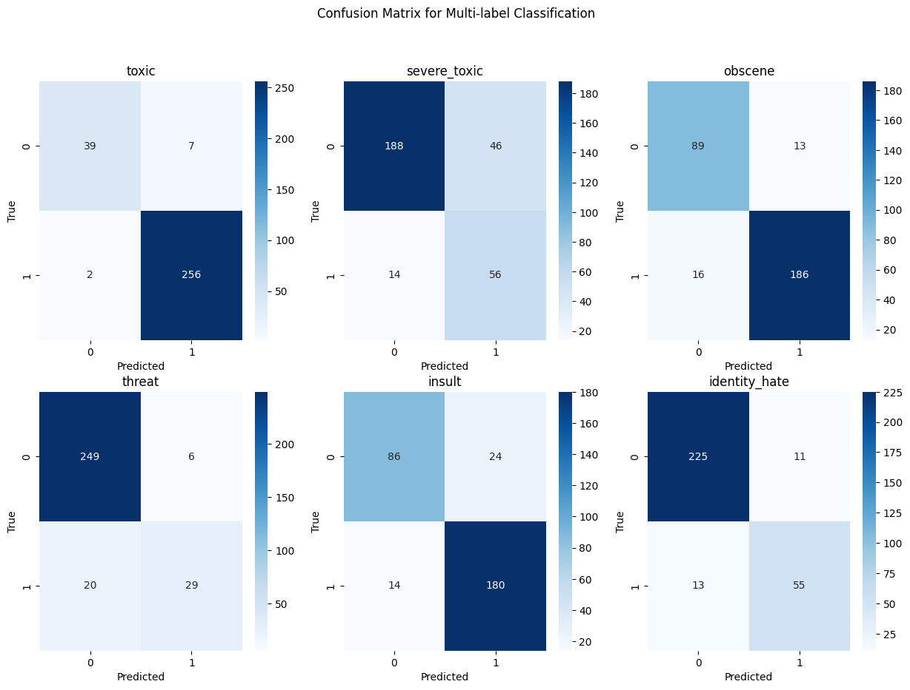

# Social-Media-Toxicity-Moderation

The Purpose of the project is to introduce a new paradim in Socail Media Toxicity Moderation. The recent popularity of LLMs has led to it adaptions for many downstream tasks. Hence we use LLAMA-2 7B with 4 bit quantization for toxic content moderation across 6 toxic categories. The toxicity classification dataset from Kaggle comprises labeled Wikipedia comments, categorized into various types of toxicity, including toxic, severe_toxic, obscene, threat, insult, and identity_hate. This dataset is crucial in the era of social media as it addresses the growing concern of online toxicity. With the rise of digital communication platforms, understanding and predicting the presence of toxic behavior in user-generated content is essential for maintaining a healthy online environment. The classification model developed from this dataset can assist in automating the identification and moderation of harmful content, fostering a safer and more inclusive online community for users.

# Model Choice 

LLAMA-2's significance extends beyond licensing adjustments. It pioneers Parameter-Efficient Fine-Tuning (PEFT), a technique that notably streamlines the fine-tuning process by reducing the number of model parameters requiring updates. This efficiency not only accelerates training times but also reduces computational costs, making LLAMA-2 a resource-efficient option for researchers and developers. Moreover, its baseline performance shines across diverse benchmarks, consistently surpassing other LLMs in terms of accuracy and effectiveness. This robust performance suggests that fine-tuned LLAMA-2 models hold promise across various applications, establishing it as a compelling choice in the landscape of advanced language models.

# Results 

The results of the fine-tuned model showcase exceptional accuracy, F1 scores, precision, and recall, particularly when addressing the challenges posed by imbalanced data. Notably, the model's performance in threat classification is acknowledged as an area for potential improvement, attributed to the limited number of training examples for this class. It is evident that with increased data on minority classes and further training, the model's capabilities can be optimized, promising even better results in future iterations. The deployment of techniques like Quantization and PEFT, alongside the capabilities of LLAMA-2, underscores the potential of state-of-the-art language models for complex classification tasks.

#Future Research Directions**:

* Mistral AI's release of an MoE model, a scaled-down version of GPT-4 with 8 experts, presents an intriguing avenue for exploration. Mixture of Experts is a technique that divides complex tasks into smaller, specialized sub-tasks, each handled by an expert. Mistral's MoE model, with only 2 experts used for the inference of each token, showcases a more efficient architecture. The model achieves a significant reduction in parameters compared to GPT-4 while maintaining a comparable context size. Future research could delve into the application of MoE techniques for enhancing the efficiency and accuracy of text classification tasks. Understanding how to leverage the expertise of specialized models for different aspects of text classification and generation may lead to significant advances in text classification particulary on hard datsets like Toxicity classification
